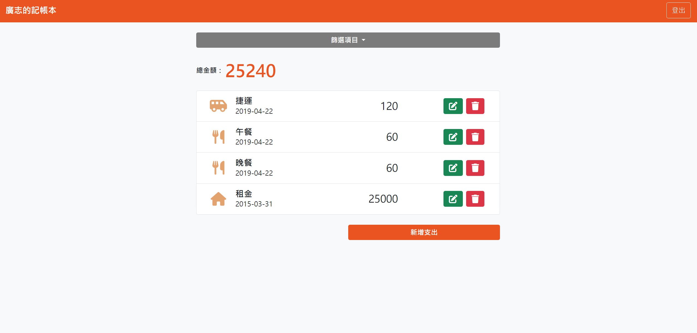

# 家庭記帳本



## 功能介紹

讓使用者可記錄自己的開銷

- 可觀看支出紀錄(需登入)
- 可分類觀看每一項支出
- 可新增支出
- 可編輯支出
- 可刪除支出
  
- 使用者可註冊新帳號或使用FB登入

## 如何使用

1. 請先確認有安裝 node.js 與 npm
2. 將專案 clone 到本地
3. 在本地開啟之後，透過終端機進入資料夾，輸入：

   ```bash
   npm install
   ```

4. 根據 .env.example 設定環境變數，新增 .env 檔案，檔案中輸入：

  PORT = 3000
  SESSION_SECRET = 'ThisIsMySecret'
  MONGODB_URI = <Your own MongoDB connection URL>
  FACEBOOK_ID = <Facebook 應用程式編號>
  FACEBOOK_SECRET = <Facebook 應用程式密鑰>
  FACEBOOK_CALLBACK = "http://localhost:3000/auth/facebook/callback"

5. 設定完畢後，繼續輸入：

   ```bash
   npm run dev
   ```

6. 若看見此行訊息則代表順利運行

   ```bash
   Listening on http://localhost:3000
   ```
   
7. 打開瀏覽器進入到以下網址：
   http://localhost:3000

8. 若欲暫停使用

   ```bash
   ctrl + c
   ```
## 種子資料
若需載入預設種子資料：

1. 請在終端機輸入：

   ```bash
   npm run seed
   ```
   
2. 種子資料載入成功後會顯示：

   ```bash
   done!
   ```

3. 以下是預設使用者資料：
   - 使用者1: 廣志
     電子信箱：hiroshi@example.com
     密碼：12345678
   - 使用者2: 小新
     電子信箱：shi5555@example.com
     密碼：12345678
